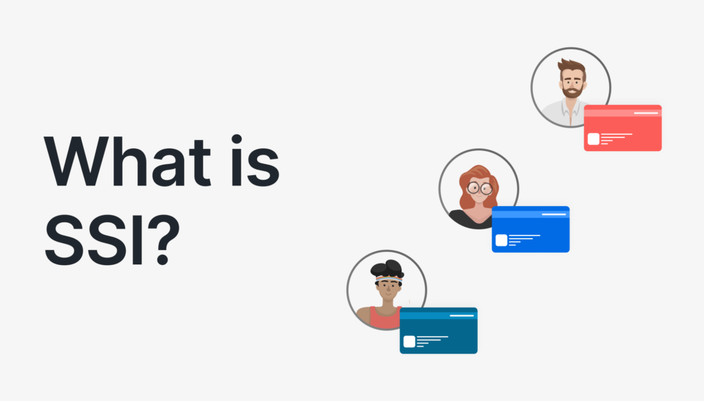

# Self-Sovereign Identity (SSI) Tutorial

### Table of content

- [What is SSI](#self-sovereign-identity-ssi-tutorial)
- [Key Concepts of SSI](#key-concepts-of-ssi)
- [Key Benefits of SSI](#key-benefits-of-ssi)
- [The Trust Triangle](#the-trust-triangle)
- [How SSI Works in Real Life](#how-ssi-works-in-real-life)
  - [Issuer](#1-issuer)
  - [Holder](#2-holder-you)
  - [Verifier](#3-verifier-the-checker)
- [Technical Workflow of SSI Entities](#technical-workflow-of-ssi-entities)
  - [Initial setup](#initial-setup)
  - [Credential Issuance and Verification](#credential-issuance-and-verification)
- [Demonstration Setup Guide](#demonstration-setup-guide)
- [API Overview](#api-overview)
- [Conclusion](#conclusion)



**Self-Sovereign Identity (SSI)** is a digital identity model that allows individuals to own, control, and share their personal information without relying on a central authority. In SSI, users can create and manage their identities using decentralized technologies, such as blockchain, which enhances privacy, security, and user autonomy.

### Key Concepts of SSI

| Concept                                                  | Traditional Way                                                                              | SSI Way                                                           | Benefits                                                                                                                     |
| -------------------------------------------------------- | -------------------------------------------------------------------------------------------- | ----------------------------------------------------------------- | ---------------------------------------------------------------------------------------------------------------------------- |
| **Decentralization** <br> _"You're in Control"_          | Need Facebook/Google accounts to log into websites. Companies control your digital identity. | You control your own digital identity, like your physical wallet. | • No dependency on companies <br> • Full control over your identity <br> • Single identity for all services                  |
| **Verifiable Credentials** <br> _"Digital Certificates"_ | Physical certificates and ID cards in your wallet.                                           | Digital versions of certificates that can't be forged.            | • Can't be faked or altered <br> • Instant sharing <br> • Selective disclosure <br> • Digital signatures from issuers        |
| **DIDs** <br> _"Your Digital Identity Number"_           | Email address or phone number owned by companies.                                            | Your own unique digital ID that belongs only to you.              | • You own it completely <br> • Not controlled by companies <br> • Can't be taken away <br> • Permanent digital address       |
| **Wallets** <br> _"Your Digital Identity Vault"_         | Physical wallet with ID cards, certificates, and licenses.                                   | Secure app storing digital credentials.                           | • Digital storage of IDs <br> • Enhanced security <br> • Selective sharing <br> • User control                               |
| **Trust triangle** <br> _"The Circle of Trust"_          | Trust based on physical documents issued by authorities.                                     | Digital credentials verified instantly through cryptography.      | • Instant verification <br> • Cryptographically secure <br> • No need to contact issuer <br> • Selective information sharing |

### Key Benefits of SSI

| Physical Documents               | Digital SSI                  |
| -------------------------------- | ---------------------------- |
| Can be lost or stolen            | Securely backed up           |
| Show all information             | Share only what's needed     |
| Manual verification needed       | Instant verification         |
| Multiple documents to carry      | All-in-one digital solution  |
| Can be forged                    | Cryptographically secure     |
| Physical presence often required | Remote verification possible |

---

### The Trust Triangle


The Trust Triangle is a foundational concept in Self-Sovereign Identity that illustrates the relationships between the three key parties involved in identity verification:

1. **The Issuer**: The trusted authority that issues verifiable credentials to the holder. This could be an educational institution, government agency, or any organization that can validate the information.

2. **The Holder**: The individual or entity that owns the identity and holds the credentials. They have full control over their personal information and can choose what to share.

3. **The Verifier**: The party that needs to verify the holder's credentials. This could be a service provider, employer, or any entity that requires proof of identity or qualifications.

The Trust Triangle emphasizes that trust is established through the relationships between these three parties, allowing for secure and private interactions without the need for a central authority.

## How SSI Works in Real Life

### 1. Issuer

_Think of this as a university, government, or any organization that issues official documents_

**What They Do:**

- Creates official digital documents (like a digital version of your degree)
- Ensures each document follows a standard format
- Adds their official digital signature
- Makes sure their documents can be verified by others

**Real-Life Example:**
Just like a university issues paper degrees, in SSI they:

- Create digital degrees that can't be forged
- Include all necessary information (grades, date, major)
- Sign it digitally (like a traditional university seal)

### 2. Holder (You)

_This is you - the person who receives and owns the credentials_

**What You Can Do:**

- Have a digital wallet on your phone (like Apple Wallet, but for your ID documents)
- Receive official documents from organizations
- Store them securely in your digital wallet
- Share only what you want, when you want

**Real-Life Example:**
Just like your physical wallet, but better:

- Store your university degree, driver's license, and certificates digitally
- Choose what to share (show age without revealing address)
- No risk of losing physical documents

### 3. Verifier (The Checker)

_Think of this as an employer or any organization that needs to verify your credentials_

**What They Do:**

- Ask for specific information they need
- Verify your digital documents instantly
- Trust the documents without calling the issuer
- Only see what you choose to share

**Real-Life Example:**
When applying for a job:

- Employer asks for proof of degree
- You share just the relevant details from your digital degree
- They can verify it's real instantly
- No need to call the university to check

---

## Technical Workflow of SSI Entities


### Initial Setup

1. **DID Creation and Registration**

   - Issuer creates and registers institutional DID on ledger
   - Holder creates personal DID for identity management
   - Verifier establishes organizational DID for verification purposes

2. **Schema Registration (by Issuer)**

   - A schema defines the structure of the credentials that can be issued. It includes attributes such as name, version, and the specific data fields that will be included in the credential.
   - Issuer registers schema on the ledger
   - Example attributes: `name`, `date`, `degree_type`, `institution`

3. **Credential Definition Setup (by Issuer)**
   - A credential definition links a schema to a specific credential type and includes additional metadata, such as the issuer's DID and the credential's unique identifier. This allows for the creation of verifiable credentials based on the registered schema.
   - Issuer publishes credential definition to ledger.

### Credential Issuance and Verification

#### A. Credential Issuance Flow

1. **Connection Establishment**

   - Issuer and holder create secure DID connection
   - Exchange connection protocols
   - Establish encrypted channel

2. **Credential Creation**
   - Issuer prepares credential data
   - Maps data to schema structure
   - Generates cryptographic signatures
   - Issues credential to holder's wallet

#### B. Credential Storage

1. **Holder's Wallet-**
   - Securely stores received credentials
   - Maintains proof requests history
   - Handles key management

#### C. Verification Flow

1. **Proof Request**

   - Verifier sends proof request
   - Specifies required attributes
   - Defines predicates (if any)

2. **Proof Generation**

   - Holder receives proof request
   - Selects appropriate credentials
   - Generates zero-knowledge proofs
   - Creates proof presentation

3. **Verification Process**
   - Verifier receives proof presentation
   - Validates cryptographic signatures
   - Checks revocation status
   - Verifies credential claims

---

## Demonstration Setup Guide

### Prerequisites

- Node.js (v18)
- Yarn package manager
- Git

### Credo Agent Setup (demo/credo)

```bash
# Navigate to credo directory
cd demo/credo

# Install dependencies
yarn install

# Environment Setup
cp .env.example .env

# Configure .env file
ISSUER_DID=your_issuer_did
ISSUER_SEED=your_issuer_seed
VERIFIER_DID=your_verifier_did
VERIFIER_SEED=your_verifier_seed
ISSUER_API_PORT=4000
VERIFIER_API_PORT=4002
ISSUER_AGENT_PUBLIC_ENDPOINT=http://{ your ip address }:4000
VERIFIER_AGENT_PUBLIC_ENDPOINT=http://{ your ip address }:4002
```

### Interface Setup

```bash
# Navigate to interface directory
cd interface

# Install dependencies
yarn install

# Environment Setup
cp .env.example .env

# Configure .env file
NEXT_PUBLIC_ISSUER_AGENT_URL=http://{ your ip address }:4001
NEXT_PUBLIC_VERIFIER_AGENT_URL=http://{ your ip address }:4002
NEXT_PUBLIC_ISSUER_LABEL="University"
NEXT_PUBLIC_VERIFIER_LABEL="Employer"

# Start the development server
yarn dev
```

### Running the Demo

#### Directory Structure

```
/
├── demo/
│   ├── acapy/
│   │
│   └── credo/
│
└── interface/
```

**Start Credo Agents**

```bash
# In demo/credo directory
# Start issuer agent
yarn start --issuer

# In a new terminal
# Start verifier agent
yarn start --verifier
```

**Launch Interface**

```bash
# In interface directory
yarn dev
```

### Testing the Setup

1. **Create Connection**

- Generate invitation from issuer interface
- Scan the generated QR code by Bifold wallet (Holder's wallet)

2. **Issue Credential**

- Issue a credential to connection (Bifold wallet)

3. **Accept Credential**

- Accept credential from the wallet

3. **Verify Credential**

- Generate invitation from verifier interface
- Scan the generated QR code by Bifold wallet (Holder's wallet)
- Send proof request to the holder
- Share proof from the Bifold wallet
- Verify received proof

---

## API Overview

This API provides endpoints for managing agents, credentials, and interactions in an SSI ecosystem. Below are the key routes defined in `server.ts`.

### API Routes

| **SSI Feature**                    | **Purpose**                                           | **API Endpoint**                 |
| ---------------------------------- | ----------------------------------------------------- | -------------------------------- |
| **Get Wallet DIDs**                | Retrieve the DIDs associated with the user's wallet.  | `GET /wallet-dids`               |
| **Register Schema**                | Create a new schema for credentials.                  | `POST /create-schema`            |
| **Register Credential Definition** | Create a new credential definition based on a schema. | `POST /credential-definition`    |
| **Create Connection Invitation**   | Create an invitation for a connection.                | `POST /create-invitation`        |
| **Get All Connections**            | Retrieve details about existing connections.          | `GET /connections`               |
| **Send Message**                   | Send a message to a connection.                       | `POST /send-message`             |
| **Issue Credential**               | Issue a new credential to a connection.               | `POST /issue-credential`         |
| **Get All Issued Credentials**     | Retrieve details of issued credentials.               | `GET /issued-credentials`        |
| **Send Proof Request**             | Send a proof request to a connection.                 | `POST /send-proof-request`       |
| **Get All Proof Requests Data**    | Retrieve proof records associated with a connection.  | `GET /proof-records`             |
| **Retrieve Proof Data**            | Retrieve proof data for a specific proof record.      | `GET /proof-data/:proofRecordId` |

#### 1. **GET /wallet-dids**

- **Description**: Retrieve the DIDs associated with the user's wallet.
- **Query Parameters**:
  - `method`: The method to use for fetching DIDs.
- **Response**: Returns a list of DIDs.

#### 2. **POST /create-invitation**

- **Description**: Create an invitation for a connection.
- **Request Body**:
  - `label`: A label for the invitation.
  - `alias`: An alias for the invitation.
  - `domain`: The domain associated with the invitation.
- **Response**: Returns the invitation details.

#### 3. **GET /connections**

- **Description**: Retrieve connection details.
- **Query Parameters**:
  - `connectionId`: The ID of the connection.
  - `outOfBandId`: The out-of-band ID for the connection.
- **Response**: Returns connection details.

#### 4. **POST /create-schema**

- **Description**: Create a new schema for credentials.
- **Request Body**:
  - `did`: The DID of the issuer.
  - `name`: The name of the schema.
  - `version`: The version of the schema.
  - `attributes`: An array of attributes for the schema.
- **Response**: Returns the created schema details.

#### 5. **GET /schemas**

- **Description**: Retrieve schema details.
- **Query Parameters**:
  - `schemaId`: The ID of the schema to retrieve.
- **Response**: Returns the schema details.

#### 6. **POST /credential-definition**

- **Description**: Create a new credential definition.
- **Request Body**:
  - `did`: The DID of the issuer.
  - `schemaId`: The ID of the schema.
  - `tag`: A tag for the credential definition.
- **Response**: Returns the created credential definition details.

#### 7. **GET /credential-definitions**

- **Description**: Retrieve credential definition details.
- **Query Parameters**:
  - `credentialDefinitionId`: The ID of the credential definition.
- **Response**: Returns the credential definition details.

#### 8. **POST /issue-credential**

- **Description**: Issue a new credential to a connection.
- **Request Body**:
  - `connectionId`: The ID of the connection.
  - `name`: The name of the credential holder.
  - `email`: The email of the credential holder.
  - `age`: The age of the credential holder.
- **Response**: Returns the issued credential details.

#### 9. **GET /issued-credentials**

- **Description**: Retrieve issued credentials.
- **Query Parameters**:
  - `credentialId`: The ID of the credential to retrieve.
- **Response**: Returns the issued credential details.

#### 10. **POST /send-proof-request**

- **Description**: Send a proof request to a connection.
- **Request Body**:
  - `proofRequestlabel`: A label for the proof request.
  - `connectionId`: The ID of the connection.
  - `version`: The version of the proof request.
- **Response**: Returns the result of the proof request.

#### 11. **GET /proof-records**

- **Description**: Retrieve proof records.
- **Query Parameters**:
  - `proofRecordId`: The ID of the proof record to retrieve.
- **Response**: Returns the proof record details.

#### 12. **GET /proof-data/:proofRecordId**

- **Description**: Retrieve proof data for a specific proof record.
- **Path Parameters**:
  - `proofRecordId`: The ID of the proof record.
- **Response**: Returns the proof data.

#### 13. **POST /send-message**

- **Description**: Send a message to a connection.
- **Request Body**:
  - `connectionId`: The ID of the connection.
  - `message`: The message content.
- **Response**: Returns the result of the message sending.

## Conclusion

By leveraging the principles of SSI, users can maintain control over their personal information while interacting securely with various services.

For further information, please refer to the documentation of the underlying libraries and technologies used in this implementation.
